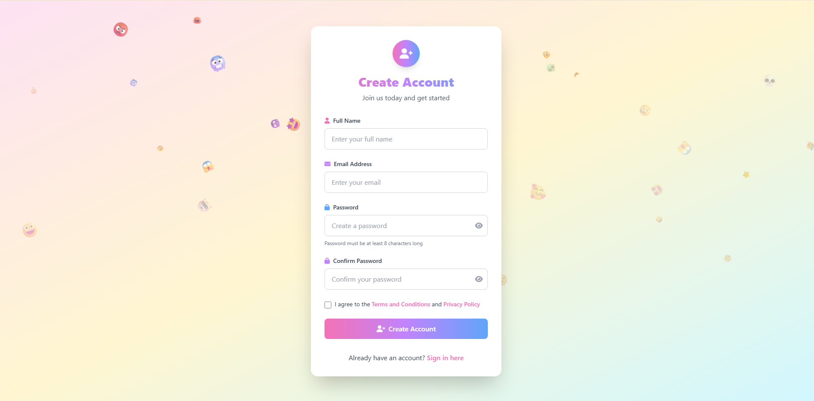
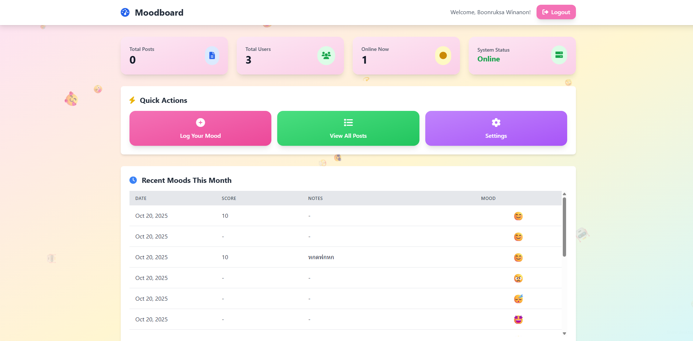

<p align="center"><a href="https://laravel.com" target="_blank"></a></p>

<p align="center">
<a href="https://github.com/laravel/framework/actions"></a>
<a href="https://packagist.org/packages/laravel/framework"></a>
<a href="https://packagist.org/packages/laravel/framework"></a>
<a href="https://packagist.org/packages/laravel/framework"></a>
</p>

# Laravel Mood Tracker

**Laravel Mood Tracker** เป็นเว็บแอปพลิเคชันสำหรับบันทึกและติดตามอารมณ์ในแต่ละวัน สร้างขึ้นด้วย [Laravel Framework](https://laravel.com/) ช่วยให้ผู้ใช้สามารถเห็นภาพรวมของสุขภาพจิตของตนเองผ่านประวัติการบันทึกอารมณ์

## ✨ ฟีเจอร์หลัก

- **🔐 ระบบสมาชิก:** ลงทะเบียน, เข้าสู่ระบบ และออกจากระบบอย่างปลอดภัย
- **📊 แดชบอร์ด:** แสดงประวัติการบันทึกอารมณ์ของผู้ใช้ในรูปแบบที่เข้าใจง่าย
- **📝 การบันทึกอารมณ์:** ฟอร์มสำหรับเพิ่มบันทึกอารมณ์ใหม่ได้อย่างรวดเร็ว

## 📸 ภาพหน้าจอ

*(เพิ่มภาพหน้าจอของแอปพลิเคชันที่นี่)*

| หน้าลงทะเบียน | หน้าแดชบอร์ด |
| :---: | :---: |
|  |  |

## 🛠️ เทคโนโลยีที่ใช้

- **Backend:** PHP / Laravel
- **Frontend:** Blade Template Engine, Vite
- **Database:** SQLite (หรือฐานข้อมูลอื่น ๆ ที่ Laravel รองรับ)

## 🚀 ขั้นตอนการติดตั้ง

1.  **Clone a repository:**
    ```bash
    git clone https://github.com/USERNAME/laravel-mood.git
    cd laravel-mood
    ```

2.  **ติดตั้ง Dependencies:**
    ```bash
    composer install
    npm install
    ```

3.  **ตั้งค่า Environment:**
    คัดลอกไฟล์ `.env.example` ไปเป็น `.env` และตั้งค่าตัวแปรที่จำเป็น
    ```bash
    cp .env.example .env
    ```

4.  **สร้าง Application Key:**
    ```bash
    php artisan key:generate
    ```

5.  **Migrate ฐานข้อมูล:**
    ```bash
    php artisan migrate
    ```

## 💡 วิธีใช้งาน

1.  **Build Assets:**
    ```bash
    npm run dev
    ```

2.  **รัน Development Server:**
    ```bash
    php artisan serve
    ```

3.  เข้าสู่แอปพลิเคชันผ่าน `http://127.0.0.1:8000`

## 📄 License

The Laravel framework is open-sourced software licensed under the [MIT license](https://opensource.org/licenses/MIT).
